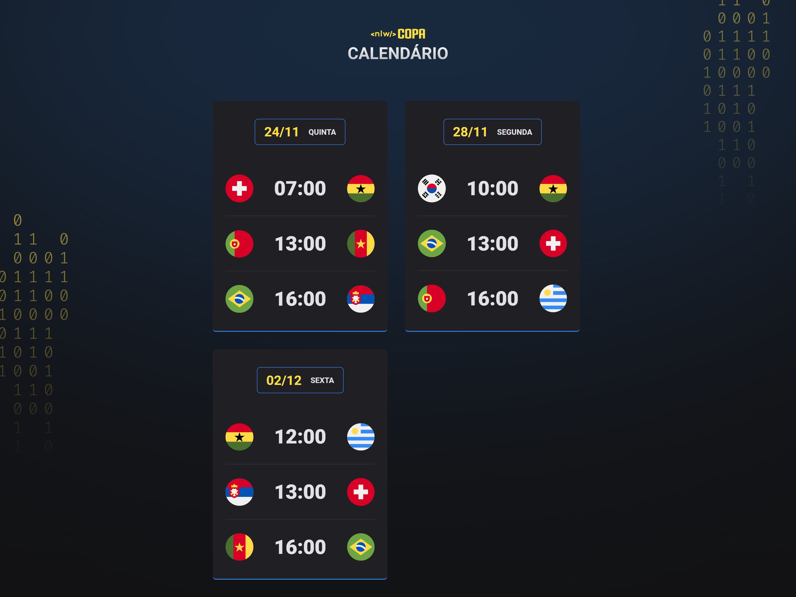
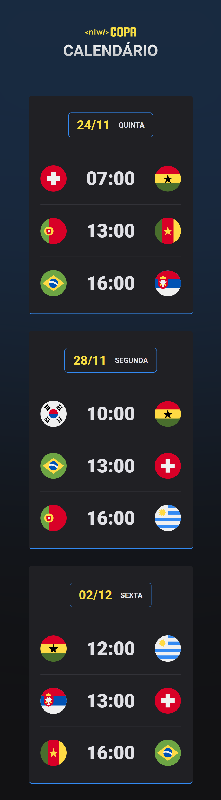

# NLW #10 - Copa

## :soccer: **Projeto**
> "Calendário pessoal de jogos da Copa do Mundo de 2022".

Este projeto foi feito no evento Next Level Week (NLW) #10 da Rocketseat, trazendo como temática a Copa do Mundo de 2022. Ele apresenta uma pequena página web que contém cartões com os dias, horários e jogos que irão acontecer durante a Copa.

   <a href="https://nlw-copa-explorer-pied.vercel.app">Veja o projeto completo aqui.</a>

## :art: **Visual do Projeto**
### *Desktop e Telas Maiores*
<h1 align="center">
    
</h1>

### *Mobile e Telas Menores*
<h1 align="center">
    
</h1>

## :straight_ruler: **Layout**

Você pode visualizar o layout do projeto clicando [aqui](https://www.figma.com/community/file/1169028052212317700).

## :wrench: **Tecnologias**
Tecnologias utilizadas no projeto.
* HTML;
* CSS;
* JavaScript;
* Visual Studio Code;
* Google Fonts.

## :memo: **Licença**

Esse projeto está sob a licença MIT.

  

Feito com ♥ por [Rocketseat](https://rocketseat.com.br/) e com :purple_heart: por [David Silva](https://www.linkedin.com/in/davsilvam/).

---
